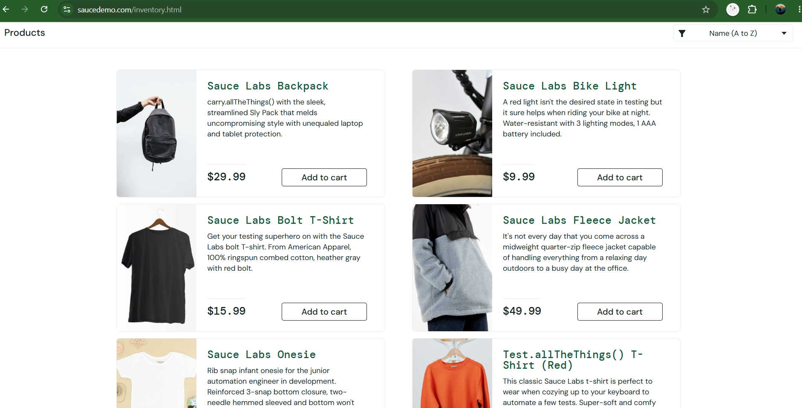
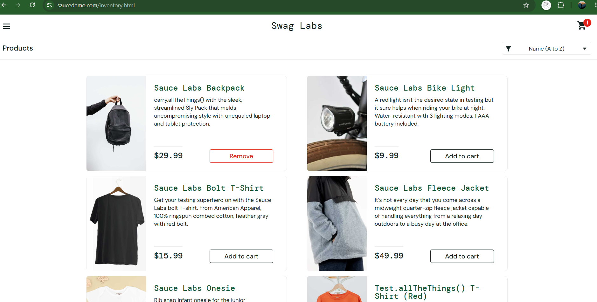
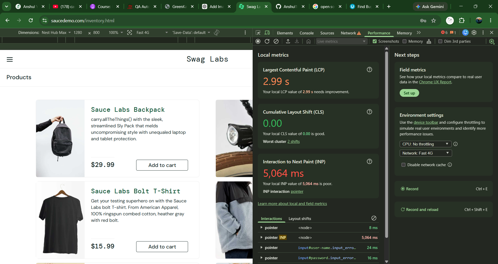

## Bug Report

# BUG001 - Wrong Product Image Displayed

### Module

Product

### User

problem_user

### Steps to Reproduce

1 open https://www.saucedemo.com/
2 Login with :
Username : problem_user
Password : secret_sauce
3 Navigate to Product Page
4 Observe the product image

### Expected Result

Correct image should be displayed for each product

### Actual Result

Wrong Images displayed

### Severity

Medium

### Priority

Medium

### Status

Open

### Screenshot

---

# BUG002 - Add TO Cart Functionality does not work for some items

### Module

Product

### User

error_user

### Steps to Reproduce

1 open https://www.saucedemo.com/
2 Login with :
Username : error_user
Password : secret_sauce
3 Navigate to Product Page
4 Click to ADD to cart Button

### Expected Result

Items should be added to cart

### Actual Result

Some items not added to cart

### Severity

Critical

### Priority

High

### Status

Open

### Screenshot

---

# BUG003 - Remove TO Cart Functionality does not work

### Module

Product

### User

error_user

### Steps to Reproduce

1 open https://www.saucedemo.com/
2 Login with :
Username : error_user
Password : secret_sauce
3 Navigate to Product Page
4 Click to Remove to cart Button

### Expected Result

Product should be remove from cart

### Actual Result

Product not remove from cart

### Severity

Medium

### Priority

Medium

### Status

Open

### Screenshot

---

# BUG004 - Error in UI of Product page

### Module

Product

### User

visual_user

### Steps to Reproduce

1 open https://www.saucedemo.com/
2 Login with :
Username : visual_user
Password : secret_sauce
3 Navigate to Product Page
4 Observe the icons on product page

### Expected Result

All icons should displayed properly

### Actual Result

Buttons, icons will not displayed properly or UI layout looks broken

### Severity

Low

### Priority

High

### Status

Open

### Screenshot

---

# BUG005 - Performance issue

### Module

Product

### User

performance_glitch_user

### Steps to Reproduce

1 open https://www.saucedemo.com/
2 Login with :
Username : performance_glitch_user
Password : secret_sauce
3 Navigate to Product Page
4 Click on any button
5 Observe the loading time

### Expected Result

As click on any functionality , the page should navigate fastly

### Actual Result

As click on any button , the reloading takes much time

### Severity

Medium

### Priority

High

### Status

Open

### Screenshot

