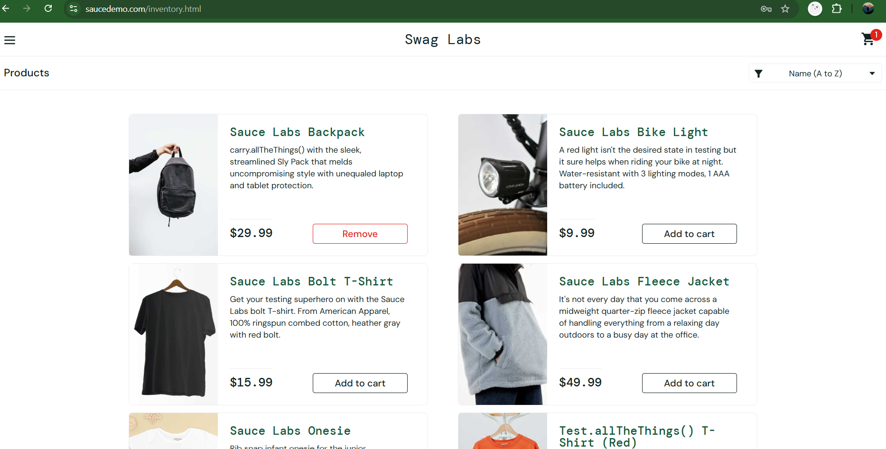
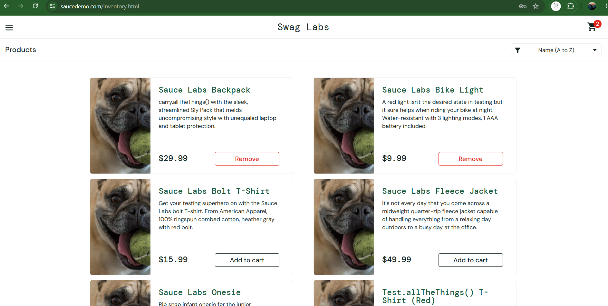
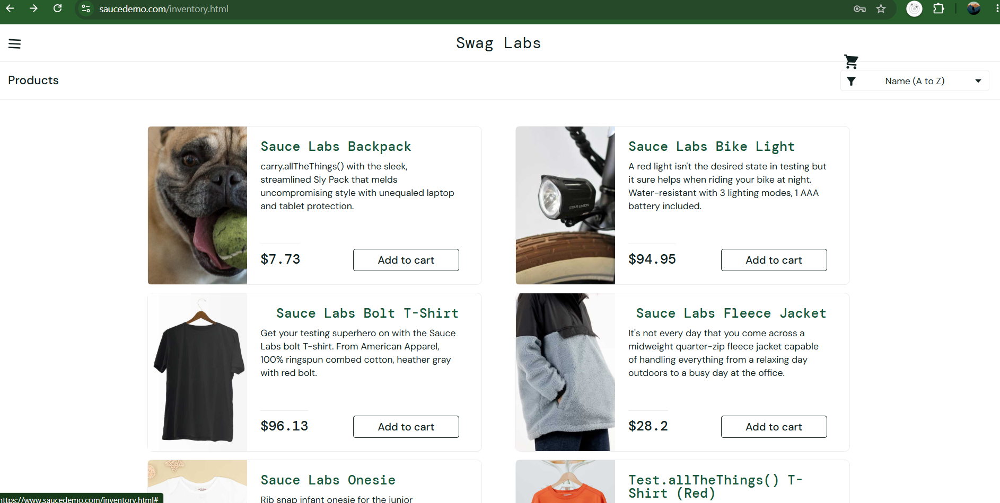

# SauceDemo Manual Testing Project

## Project Overview

Performed manual testing on SauceDemo E-commerce Website and validated different modules using functional testing techniques.

## Tools Used

Git & GitHub
VS Code

## Login Module Execution Evidence

### TC001 - Valid Login

### TC002 - Invalid Password

## Product Module

### TC011 - Product List

### TC015 - Add TO Cart

## Bug Report

### BUG001 - Incorrect Product Image

### BUG004 - UI Misalignment

