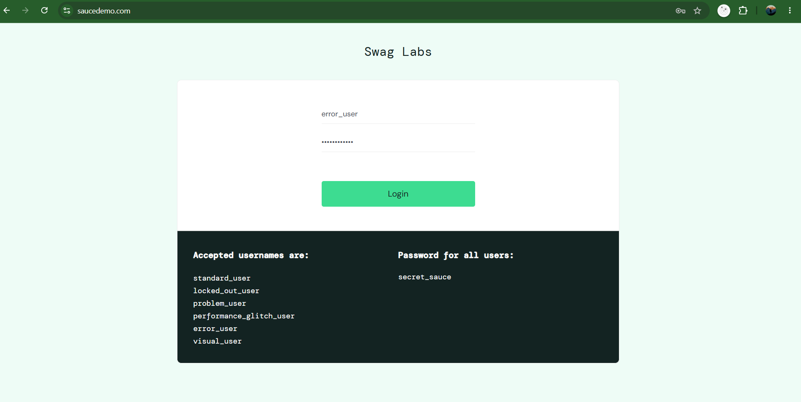

# SauceDemo Manual Testing Project

## Project Overview

Performed manual testing on SauceDemo E-commerce Website and validated different modules using functional testing techniques.

## Tools Used

Git & GitHub
VS Code

## Login Module Execution Evidence

### TC001 - Valid Login

### TC002 - Invalid Password

### TC003 - Invalid Username

### TC004 - Blank Username

### TC005 - Blank Password

